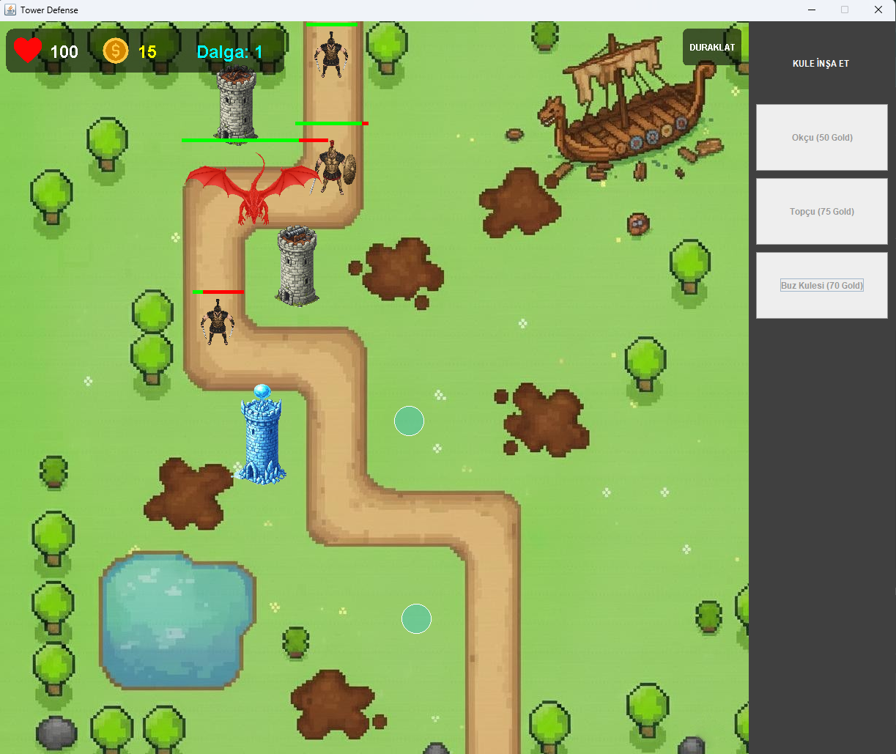
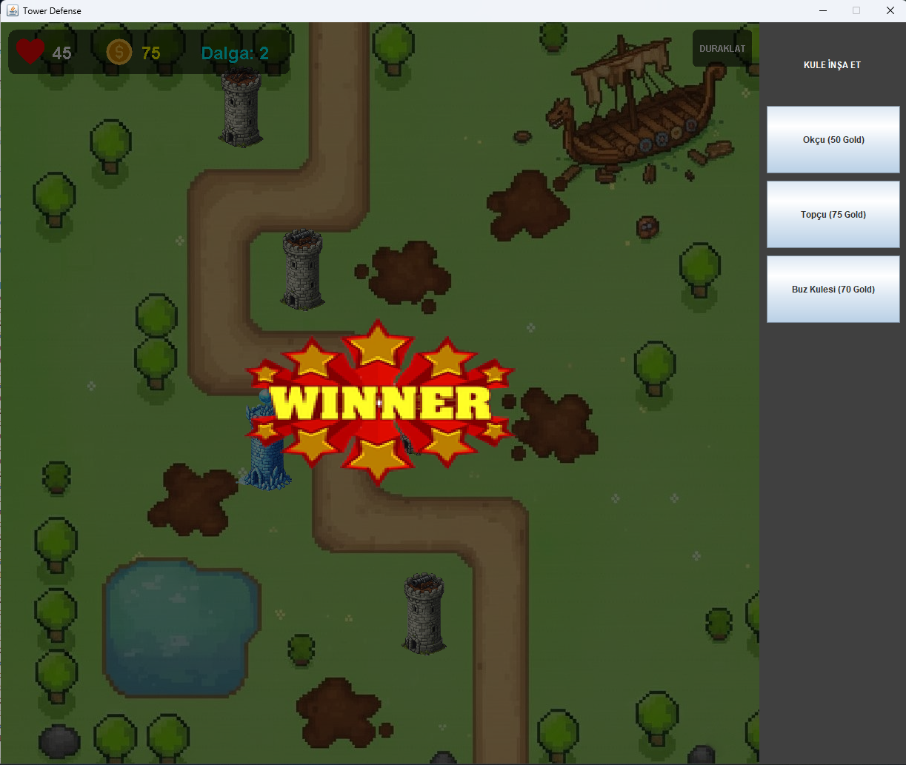
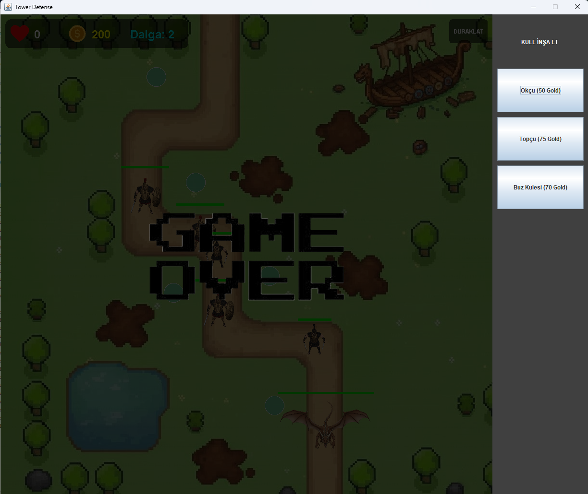

# Tower Defense Game (Java)

This project is a simple **Tower Defense style game** developed using **Java** and **Swing**.
The game is based on object-oriented programming principles and basic game loop logic.

##  Game Overview
- Enemies follow a predefined path
- Player places towers to stop enemies
- Towers shoot bullets automatically
- Enemies have health and can be destroyed
- Game ends when enemies reach the end point

##  Project Structure

### Model
Contains core game entities:
- `Enemy` classes (Dragon, Viking, BuzKulesi, etc.)
- `Tower` classes (Topcu, Okcu)
- `Bullet` classes (Mermi, Kule)
- Game logic and mechanics

### View
Handles the graphical interface:
- `GamePanel` for rendering the game
- `KontrolPaneli` for user interaction
- `MainFrame` as the main application window

### Resources
Includes all game assets:
- Enemy sprites
- Tower images
- Bullet and map images

##  Technologies Used
- Java
- Java Swing
- Object-Oriented Programming (OOP)

##  How to Run
1. Clone the repository
2. Open the project in NetBeans or IntelliJ IDEA
3. Run `MainFrame.java`

##  Notes
This project was developed for educational purposes to practice:
- OOP concepts
- Game logic
- Java GUI programming

## Screenshots

### Main Gameplay Screen

### Victory Screen
Displayed when all enemy waves are defeated.

### Defeat Screen
Displayed when enemies reach the end of the path.

Developed by **Emre Ouzoun**
